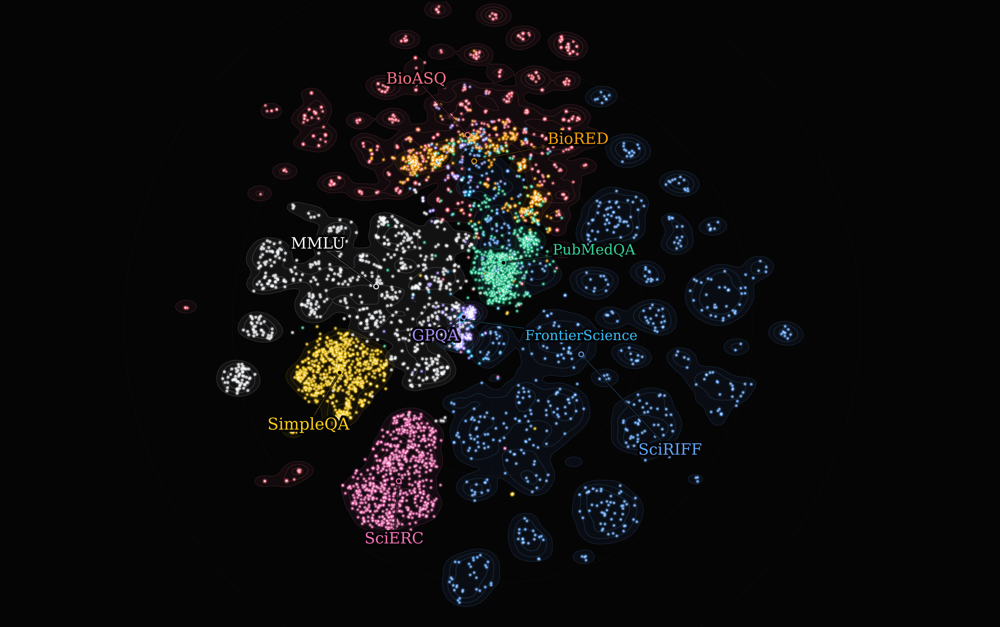

### scienceeval

Helpful evals for understanding the capabilities of models across a broad swath of science benchmarks.

The map shows a balanced visible sample from 69,315 benchmark items embedded with
`pplx-embed-v1-0.6B`, PCA-reduced to 50 dimensions, and projected with t-SNE.
Soft contours show the full-corpus distribution.

### evals in consideration

- SciERC
- BioASQ
- BioRED
- SciRIFF
- MMLU
- SimpleQA
- PubMedQA
- GPQA
- [FrontierScience](https://openai.com/index/frontierscience/)
